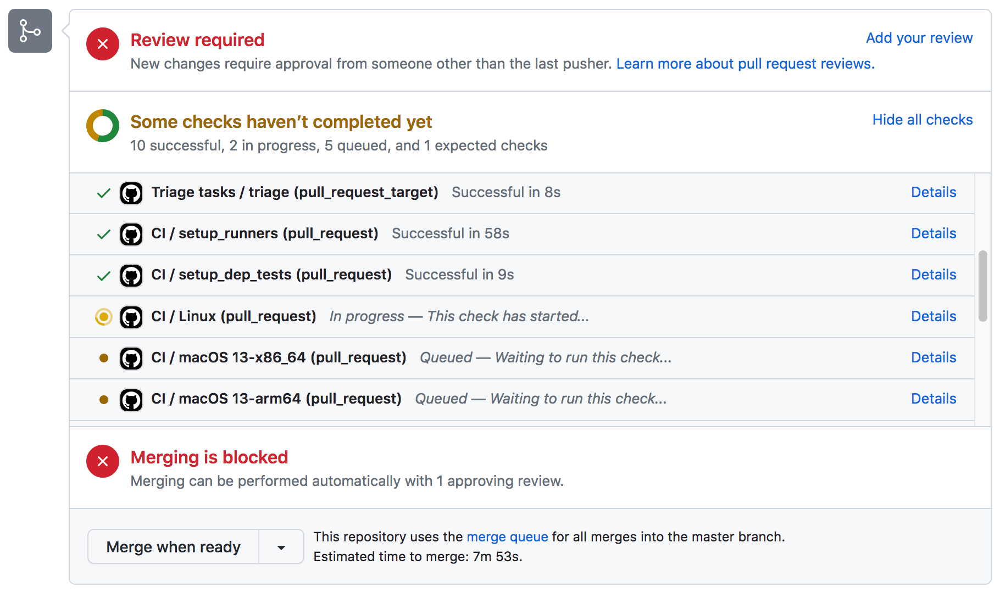
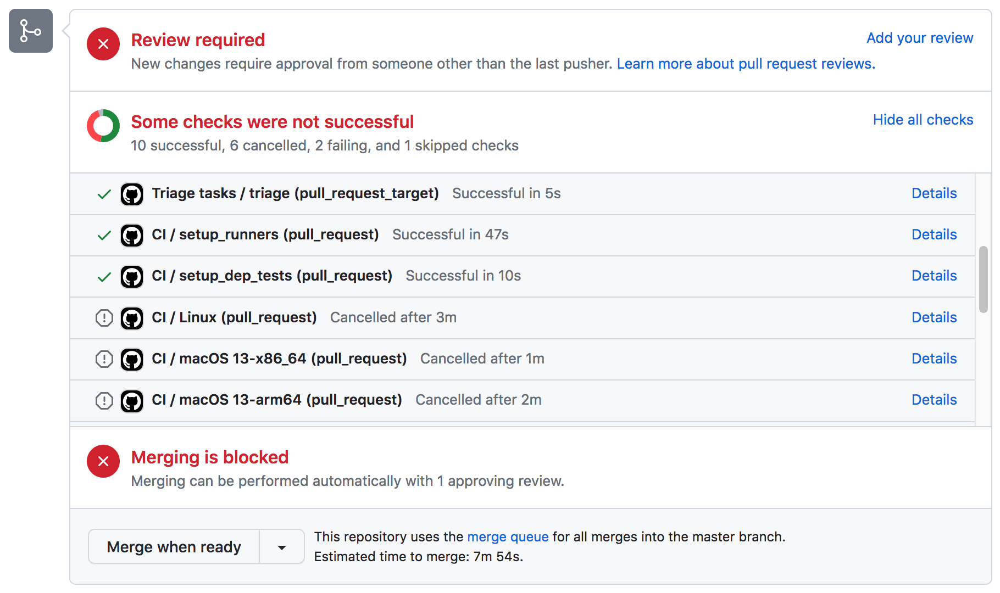
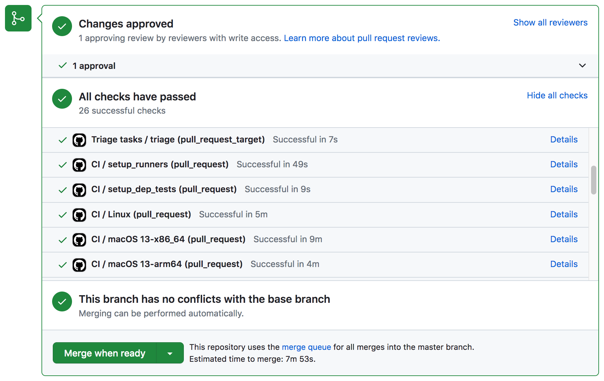

# Brew Test Bot

[`brew test-bot`](Manpage.md#test-bot-options-formula) is what runs the automated review and testing system funded by [our Kickstarter in 2013](https://www.kickstarter.com/projects/homebrew/brew-test-bot).

It comprises three Mac Pros hosting virtual machines, several Intel and M1 Mac minis and some cloud Ubuntu instances that run the [`test-bot.rb`](https://github.com/Homebrew/homebrew-test-bot) external command to perform bottle builds and automated testing of the full lifecycle of any change to Homebrew or its taps.

## Pull Requests

The bot automatically builds pull requests and updates their status depending on the result of the job.

For example, a job which has been queued but not yet completed will have a section in the pull request that looks like this:

---

A failed build looks like this:

---

A passed build that's been approved to merge looks like this:

---

On failed or passed builds you can click the "Details" link for each check to view its output in GitHub Actions.
