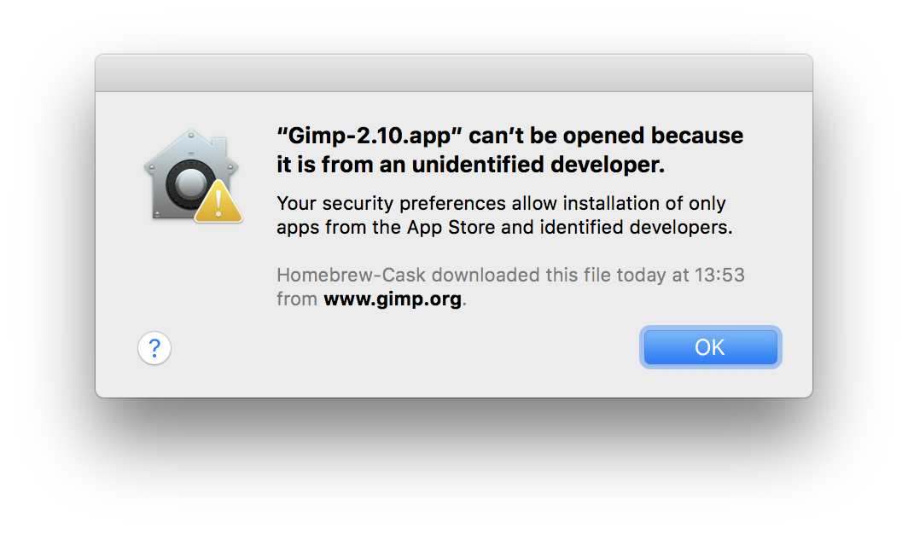
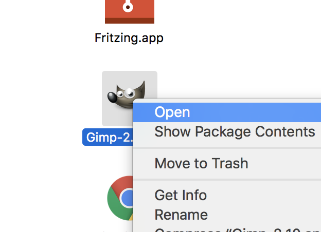
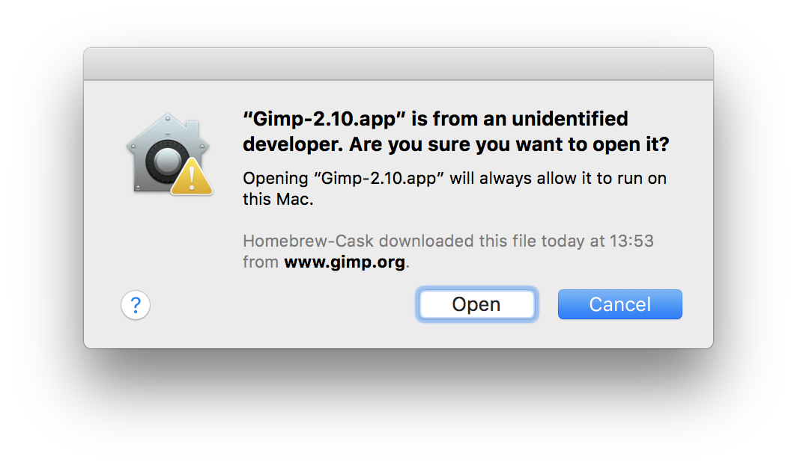
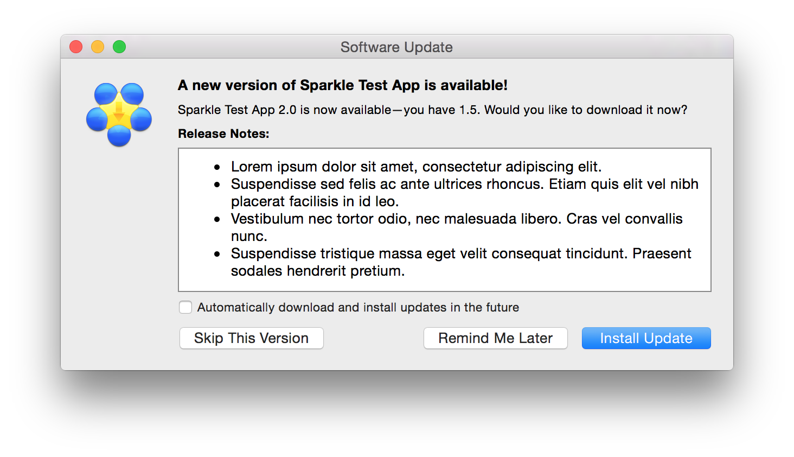

# FAQ (Frequently Asked Questions)

* Table of Contents
{:toc}

## Is there a glossary of terms around?

The Formula Cookbook has a list of [Homebrew terminology](Formula-Cookbook.md#homebrew-terminology).

## How do I update my local packages?

First update all package definitions (formulae) and Homebrew itself:

    brew update

You can now list which of your installed packages (kegs) are outdated with:

    brew outdated

Upgrade everything with:

    brew upgrade

Or upgrade a specific formula with:

    brew upgrade <formula>

## How do I stop certain formulae from being updated?

To stop something from being updated/upgraded:

    brew pin <formula>

To allow that formulae to update again:

    brew unpin <formula>

Note that pinned, outdated formulae that another formula depends on need to be upgraded when required, as we do not allow formulae to be built against outdated versions. If this is not desired, you can instead use `brew extract` to [maintain your own copy of the formula in a tap](How-to-Create-and-Maintain-a-Tap.md).

## How do I uninstall Homebrew?

To uninstall Homebrew, run the [uninstall script from the Homebrew/install repository](https://github.com/homebrew/install#uninstall-homebrew).

## How do I keep old versions of a formula when upgrading?

Homebrew automatically uninstalls old versions of each formula that is upgraded with `brew upgrade`, and periodically performs additional cleanup every 30 days.

To __disable__ automatic `brew cleanup`:

    export HOMEBREW_NO_INSTALL_CLEANUP=1

To disable automatic `brew cleanup` only for formulae `foo` and `bar`:

    export HOMEBREW_NO_CLEANUP_FORMULAE=foo,bar

When automatic `brew cleanup` is disabled, if you uninstall a formula, it will only remove the latest version you have installed. It will not remove all versions of the formula that you may have installed in the past. Homebrew will continue to attempt to install the newest version it knows about when you run `brew upgrade`. This can be surprising.

In this case, to remove a formula entirely, you may run `brew uninstall --force <formula>`. Be careful as this is a destructive operation.

## Why does `brew upgrade <formula>` or `brew install <formula>` also upgrade a bunch of other stuff?

Homebrew doesn't support arbitrary mixing and matching of formula versions, so everything a formula depends on, and everything that depends on it in turn, needs to be upgraded to the latest version as that's the only combination of formulae we test. As a consequence any given `upgrade` or `install` command can upgrade many other (seemingly unrelated) formulae, especially if something important like `python` or `openssl` also needed an upgrade.

## Where does stuff get downloaded?

    brew --cache

Which is usually: `~/Library/Caches/Homebrew`

## My Mac `.app`s don’t find Homebrew utilities!

GUI apps on macOS don’t have Homebrew's prefix in their `PATH` by default. If you're on Mountain Lion or later, you can fix this by running `sudo launchctl config user path "$(brew --prefix)/bin:${PATH}"` and then rebooting, as documented in `man launchctl`. Note that this sets the `launchctl` `PATH` for *all users*. For earlier versions of macOS, see [this page](https://developer.apple.com/legacy/library/qa/qa1067/_index.html).

## How do I contribute to Homebrew?

Read our [contribution guidelines](https://github.com/Homebrew/brew/blob/HEAD/CONTRIBUTING.md#contributing-to-homebrew).

## Why do you compile everything?

Homebrew provides pre-built binary packages for many formulae. These are referred to as [bottles](Bottles.md) and are available at <https://github.com/Homebrew/homebrew-core/packages>.

If available, bottled binaries will be used by default except under the following conditions:

* The `--build-from-source` option is invoked.
* No bottle is available for the machine's currently running OS version. (Bottles for macOS are generated only for supported macOS versions.)
* Homebrew is installed to a prefix other than the default (although some bottles support this).
* Formula options were passed to the install command. For example, `brew install <formula>` will try to find a bottled binary, but `brew install --with-foo <formula>` will trigger a source build.

We aim to bottle everything.

## Why should I install Homebrew in the default location?

Homebrew's pre-built binary packages (known as [bottles](Bottles.md)) of many formulae can only be used if you install in the default installation prefix, otherwise they have to be built from source. Building from source takes a long time, is prone to failure, and is not supported. The default prefix is:

* `/usr/local` for macOS on Intel,
* `/opt/homebrew` for macOS on Apple Silicon/ARM, and
* `/home/linuxbrew/.linuxbrew` for Linux.

Do yourself a favour and install to the default prefix so that you can use our pre-built binary packages. *Pick another prefix at your peril!*

## Why is the default installation prefix `/opt/homebrew` on Apple Silicon?

The prefix `/opt/homebrew` was chosen to allow installations in `/opt/homebrew` for Apple Silicon and `/usr/local` for Rosetta 2 to coexist and use bottles.

## Why is the default installation prefix `/home/linuxbrew/.linuxbrew` on Linux?

The prefix `/home/linuxbrew/.linuxbrew` was chosen so that users without admin access can still benefit from precompiled binaries via a `linuxbrew` role account. If you do not yourself have admin privileges, consider asking your admin staff to create a `linuxbrew` role account for you with home directory `/home/linuxbrew`.

## Why does Homebrew say sudo is bad?

**tl;dr** Sudo is dangerous, and you installed TextMate.app without sudo anyway.

Homebrew refuses to work using sudo.

You should only ever sudo a tool you trust. Of course, you can trust Homebrew 😉 — but do you trust the multi-megabyte Makefile that Homebrew runs? Developers often understand C++ far better than they understand `make` syntax. It’s too high a risk to sudo such stuff. It could modify (or upload) any files on your system. And indeed, we’ve seen some build scripts try to modify `/usr` even when the prefix was specified as something else entirely.

We use the macOS sandbox to stop this but this doesn't work when run as the `root` user (which also has read and write access to almost everything on the system).

Did you `chown root /Applications/TextMate.app`? Probably not. So is it that important to `chown root wget`?

If you need to run Homebrew in a multi-user environment, consider creating a separate user account specifically for use of Homebrew.

## Why isn’t a particular command documented?

If it’s not in [`man brew`](Manpage.md), it’s probably an [external command](External-Commands.md) with documentation available using `--help`.

## Why haven’t you merged my pull request?

If all maintainer feedback has been addressed and all tests are passing, bump it with a “bump” comment. Sometimes we miss requests and there are plenty of them. In the meantime, rebase your pull request so that it can be more easily merged.

## Can I edit formulae myself?

Yes! It’s easy! If `brew tap` doesn't show `homebrew/core`, set yourself up to edit a local copy:

1. Set `HOMEBREW_NO_INSTALL_FROM_API=1` in your shell environment,
2. Run `brew tap homebrew/core` and wait for the clone to complete, then
3. Run `brew edit <formula>` to open the formula in `EDITOR`.

You don’t have to submit modifications back to `homebrew/core`, just edit the formula to what you personally need and `brew install <formula>`. As a bonus, `brew update` will merge your changes with upstream so you can still keep the formula up-to-date **with** your personal modifications!

Note that if you are editing a core formula or cask you must set `HOMEBREW_NO_INSTALL_FROM_API=1` before using `brew install` or `brew update` otherwise they will ignore your local changes and default to the API.

To undo all changes you have made to any of Homebrew's repositories, run `brew update-reset`. It will revert to the upstream state on all Homebrew's repositories.

## Can I make new formulae?

Yes! It’s easy! If you already have a local copy of `homebrew/core` (see above), just use the [`brew create` command](Manpage.md#create-options-url). Homebrew will then open the formula in `EDITOR` so you can edit it, but it probably already installs; try it: `brew install <formula>`. If you encounter any issues, run the command with the `--debug` switch like so: `brew install --debug <formula>`, which drops you into a debugging shell.

If you want your new formula to be part of `homebrew/core` or want to learn more about writing formulae, then please read the [Formula Cookbook](Formula-Cookbook.md).

## How do I get a formula from someone else’s pull request?

Ensure you have a [local copy of `homebrew/core`](#can-i-edit-formulae-myself), then:

```sh
brew update
brew install hub
cd "$(brew --repository homebrew/core)"
hub fetch github_username
hub pr checkout pull_request_number
```

## Why was a formula deleted or disabled?

Use `brew log <formula>` to find out! Likely because it had [unresolved issues](Acceptable-Formulae.md) and/or [our analytics](https://formulae.brew.sh/analytics/) indicated it was not widely used.

For disabled and deprecated formulae, running `brew info <formula>` will also provide an explanation.

## Homebrew is a poor name, it's too generic; why was it chosen?

Homebrew's creator @mxcl wasn't too concerned with the beer theme and didn't consider that the project may actually prove popular. By the time Max realised that it was popular, it was too late. However, today, the first Google hit for "homebrew" is not beer related 😉

## What does "keg-only" mean?

It means the formula is installed only into the Cellar and is not linked into the default prefix. This means most tools will not find it. You can see why a formula was installed as keg-only, and instructions for including it in your `PATH`, by running `brew info <formula>`.

You can [modify a tool's build configuration](How-to-Build-Software-Outside-Homebrew-with-Homebrew-keg-only-Dependencies.md) to find keg-only dependencies. Or, you can link in the formula if you need to with `brew link <formula>`, though this can cause unexpected behaviour if you are shadowing macOS software.

## How can I specify different configure arguments for a formula?

`brew edit <formula>` and edit the formula directly. Currently there is no other way to do this.

## Why can’t I open a Mac app from an "unidentified developer"?

Chances are that certain apps will give you a popup message like this:



This is a [security feature from Apple](https://support.apple.com/en-us/HT202491). The single most important thing to know is that **you can allow individual apps to be exempt from this feature.** This allows the app to run while the rest of the system remains under protection.

**Always leave system-wide protection enabled,** and disable it only for specific apps as needed.

If you're sure you want to trust the app, you can disable protection for it by right-clicking its icon and choosing *Open*:



In the resulting dialog, click the *Open* button to have macOS permanently allow the app to run on this Mac. **Don’t do this unless you’re sure you trust the app.**



Alternatively, you may provide the [`--no-quarantine` switch](https://github.com/Homebrew/homebrew-cask/blob/HEAD/USAGE.md#options) at install time to not add this feature to a specific app.

## Why aren’t some apps included during `brew upgrade`?

After running `brew upgrade`, you may notice some casks you think should be upgrading, aren’t.

As you’re likely aware, a lot of macOS software can upgrade itself:



That could cause conflicts when used in tandem with Homebrew Cask’s `upgrade` mechanism.

When software uses its built-in mechanisms to upgrade itself, it happens without Homebrew Cask’s knowledge, causing both versions get out of sync. If you were to then upgrade through Homebrew Cask while we have a lower version of the software on record, you’d get a downgrade.

There are a few ideas to fix this problem:

* Try to prevent the software’s automated updates. It wouldn’t be a universal solution and may cause it to break. Most software on Homebrew Cask is closed-source, so we’d be guessing. This is also why pinning casks to a version isn’t available.
* Try to extract the installed software’s version and compare it to the cask, deciding what to do at that time. It’d be a complicated solution that would break other parts of our methodology, such as using versions to interpolate `url` values (a definite win for maintainability). This solution also isn’t universal, as many software developers are inconsistent in their versioning schemes (and app bundles are meant to have two version strings) and it doesn’t work for all types of software we support.

So we let software be. Anything installed with Homebrew Cask should behave the same as if it were installed manually. But since we also want to support software that doesn’t self-upgrade, we add [`auto_updates true`](https://github.com/Homebrew/homebrew-cask/blob/aa461148bbb5119af26b82cccf5003e2b4e50d95/Casks/a/alfred.rb#L18) to casks for software that does, which excludes them from `brew upgrade`.

Casks which use [`version :latest`](https://docs.brew.sh/Cask-Cookbook#version-latest) are also excluded, because we have no way to track their installed version. It helps to ask the developers of such software to provide versioned releases (i.e. include the version in the path of the download `url`).

If you still want to force software to be upgraded via Homebrew Cask, you can reference it specifically in the `upgrade` command:

    brew upgrade <cask>

Or use the `--greedy` switch:

    brew upgrade --greedy

Refer to the `upgrade` section of the [`brew` manual page](Manpage.md) for more details.

## Why do my cask apps lose their Dock position / Launchpad position / permission settings when I run `brew upgrade`?

Homebrew has two possible strategies to update cask apps: uninstalling the old version and reinstalling the new one, or replacing the contents of the app with the new contents. With the uninstall/reinstall strategy, [macOS thinks the app is being deleted without any intent to reinstall it](https://github.com/Homebrew/brew/pull/15138), and so it removes some internal metadata for the old app, including where it appears in the Dock and Launchpad and which permissions it's been granted. The content replacement strategy works around this by treating the upgrade as an in-place upgrade. However, starting in macOS Ventura, these in-place upgrades are only allowed when the updater application (in this case, the terminal running Homebrew) has [certain permissions granted](https://github.com/Homebrew/brew/pull/15483). Either the "App Management" or "Full Disk Access" permission will suffice.

Homebrew defaults to in-place upgrades when it has the necessary permissions. Otherwise, it will use the uninstall/reinstall strategy.
